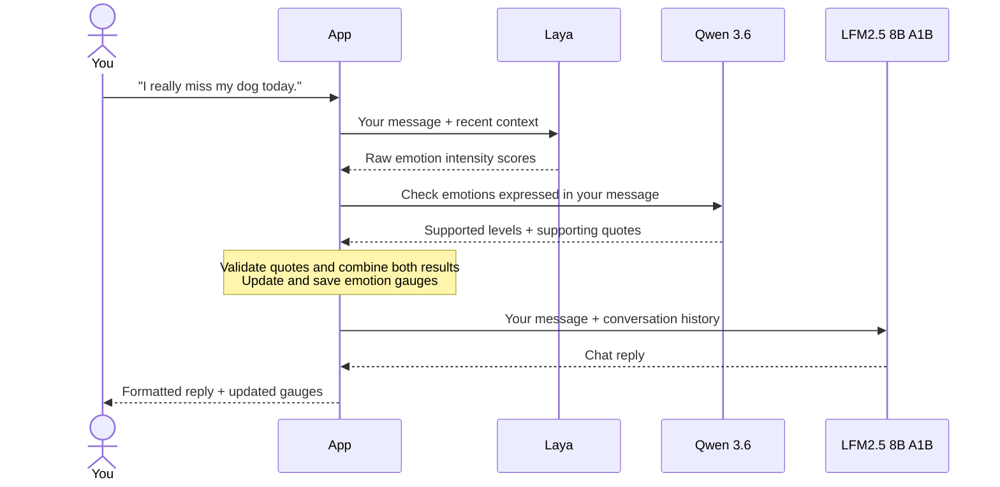

# Emotion Constellation

**Local conversations. Live emotion signals. One interactive map.**

A standalone showcase that runs on your computer, separate from CareForge.

- Chat with a local model, with thinking tucked into a small dropdown.
- Follow independent **Anxiety**, **Sadness**, and **Scared** gauges.
- Explore saved conversations in an interactive constellation and timeline.

## Recommended models

| Model | Used for | Download |
| --- | --- | --- |
| [LFM2.5-8B-A1B · Q4_K_M](https://ollama.com/library/lfm2.5:8b-a1b-q4_K_M) | Chat replies | About 5.2 GB, through Ollama |
| [Qwen3.6-35B-A3B · UD-IQ3_S](https://huggingface.co/unsloth/Qwen3.6-35B-A3B-GGUF) | Checking emotion evidence before updating scores | About 13.7 GB, through Ollama |
| [Laya · typed-decisions](https://huggingface.co/convaiinnovations/laya) | Scoring emotion intensity | Downloaded automatically on first startup |

Laya runs through its Python library. The app loads `convaiinnovations/laya` with the `typed-decisions` checkpoint. Both Ollama models are needed for the full showcase; download sizes do not include runtime memory.

## Quick start · Windows

Install [Ollama](https://ollama.com/download), [Node.js LTS](https://nodejs.org/), [Python 3.11+](https://www.python.org/downloads/), and [uv](https://docs.astral.sh/uv/getting-started/installation/). Keep Ollama running.

```powershell
git clone https://github.com/alilazo/Laya-Emotion-Detector.git
cd Laya-Emotion-Detector
```

### 1. Download the Ollama models

Run these commands in PowerShell from the project folder. Skip this step if the two local profiles already appear in `ollama list`.

```powershell
ollama pull lfm2.5:8b-a1b-q4_K_M
ollama pull hf.co/unsloth/Qwen3.6-35B-A3B-GGUF:UD-IQ3_S

@'
FROM lfm2.5:8b-a1b-q4_K_M
PARAMETER num_ctx 32768
'@ | Set-Content Modelfile.chat -Encoding ascii
ollama create lfm2.5-8b-a1b:32k -f Modelfile.chat

@'
FROM hf.co/unsloth/Qwen3.6-35B-A3B-GGUF:UD-IQ3_S
PARAMETER num_ctx 8192
'@ | Set-Content Modelfile.emotion -Encoding ascii
ollama create qwen3.6-35b-a3b:ud-iq3-s -f Modelfile.emotion
```

These profiles match the app's default model names and set a 32K chat context and an 8K evidence context. Ollama supports these [Hugging Face GGUF downloads](https://huggingface.co/docs/hub/ollama) and [model profiles](https://docs.ollama.com/modelfile).

### 2. Install the app

From the project folder:

```powershell
uv venv .venv-local
uv pip install --python .venv-local\Scripts\python.exe -r backend\requirements-dev.txt
cd frontend
npm install
npm run build
cd ..
```

This also installs the Laya library.

### 3. Launch

```powershell
.\run.ps1
```

Open the **local URL printed in the terminal**. It includes the access key. The app runs at `http://127.0.0.1:8000`; Ollama uses `http://127.0.0.1:11434/v1`. The first launch needs internet access to download Laya; inference runs locally afterward.

### Optional demo conversations

A fresh clone starts with an empty history. Add 12 clearly labeled, read-only example chats to explore the constellation:

```powershell
.\.venv-local\Scripts\python.exe -m backend.app.seed
```

Local conversations, databases, model weights, and access keys are not included in the repository.

## Configuration

Copy `.env.example` to `.env` to customize the setup. `run.ps1` loads it automatically.

```dotenv
OLLAMA_MODEL=lfm2.5-8b-a1b:32k
EMOTION_VERIFIER_MODEL=qwen3.6-35b-a3b:ud-iq3-s
LAYA_CHECKPOINT=typed-decisions
LAYA_DEVICE=cpu
```

Set `LAYA_DEVICE=cuda` if your Python environment has CUDA-enabled PyTorch. Set `EMOTION_DB_PATH` to a new SQLite path for an empty history. Conversations are saved in `data/showcase.sqlite3` by default.

## How a message is processed

### Message flow



### Why this extra middle man model?

Qwen helps interpret statements such as:

- **“My friend is scared”** — someone else's emotion.
- **“I’m not scared”** — explicitly negated.
- **“I miss my dog”** — supports sadness without automatically adding fear or anxiety.

Qwen checks which emotions the user expresses and returns supporting quotes. Laya scores intensity, while LFM2.5-8B-A1B writes the chat reply.

## Model prompts

### Qwen 3.6: emotion evidence check

Source: [evidence.py](backend/app/evidence.py). The verifier checks the user's message and returns a level and supporting quote for each emotion. Its model can be changed independently of the prompt.

<details>
<summary>Exact system prompt and example JSON</summary>

```text
Evaluate only emotions personally expressed by the CURRENT USER MESSAGE.
The recent conversation may clarify a reference or a short answer. It must not supply an emotion
missing from the current message. Do not adopt feelings suggested by the assistant. Never infer
death, danger, diagnosis, or another unstated event. A feeling attributed to someone else, a
fictional or quoted speaker, a hypothetical example, a negated feeling, and a resolved past
feeling do not count as the user's current feeling.

Score each signal INDEPENDENTLY: anxiety means anticipatory worry, nervousness, or rumination;
sadness means sorrow, missing someone, emotional hurt, grief, disappointment, or loneliness;
fear means personally feeling scared, afraid, unsafe, or threatened. Fear alone does not prove
anxiety or sadness. Worry alone does not prove fear or sadness. A sad situation does not prove
worry or fear.

Use level 0 when absent or unsupported, 1 for slight, 2 for clear moderate, 3 for strong, and
4 for overwhelming. Choose the lower supported level if uncertain. Every positive level needs
a short VERBATIM quote from the current user message that supports this emotion. Use an empty
evidence string for level 0. Quotes about someone else's feeling do not support the user's score.

Return only the requested JSON fields.
```

**Example user message:** "I really miss my dog today."

**Illustrative response, not a recorded model result:**

```json
{
  "anxiety": {
    "level": 0,
    "evidence": ""
  },
  "sadness": {
    "level": 2,
    "evidence": "I really miss my dog today"
  },
  "fear": {
    "level": 0,
    "evidence": ""
  }
}
```

The app requires all three emotions, integer levels from 0 to 4, and an evidence string. Each positive level must quote text that appears in the current user message; level 0 uses an empty string.

</details>

### Laya: emotion intensity scoring

Source: [prompts.py](backend/app/prompts.py). Laya receives three typed scoring questions instead of a chat-style system message. These are the exact instructions and criteria passed together to `agent.predict`. Criteria run from level 0 to level 4; Laya can return fractional scores.

<details>
<summary>Exact Laya scoring instructions and criteria</summary>

```json
{
  "anxiety": {
    "type": "score",
    "instructions": "Rate ANXIETY OR WORRY expressed by the CURRENT USER MESSAGE. Recent context only resolves references. Judge expressed emotion, not objective seriousness or diagnosis. Ignore emotion spoken only by the assistant, attributed to another person, quoted, hypothetical, or explicitly negated. Anxiety includes anticipatory worry, nervousness, uncertainty, rumination and dread about possible outcomes; distinguish it from fear of a specific perceived danger.",
    "criteria": [
      "No meaningful anxiety or worry expressed",
      "Slight or weak anxiety or worry",
      "Clear moderate anxiety or worry",
      "Strong anxiety or worry central to the message",
      "Very intense or overwhelming anxiety or worry"
    ]
  },
  "sadness": {
    "type": "score",
    "instructions": "Rate SADNESS expressed by the CURRENT USER MESSAGE. Recent context only resolves references. Judge expressed emotion without diagnosis. Ignore sadness spoken only by the assistant, attributed to another person, quoted, hypothetical, or explicitly negated. Sadness includes sorrow, grief, disappointment, hurt, loneliness and feeling down.",
    "criteria": [
      "No meaningful sadness expressed",
      "Slight or weak sadness",
      "Clear moderate sadness",
      "Strong sadness central to the message",
      "Very intense or overwhelming sadness or grief"
    ]
  },
  "fear": {
    "type": "score",
    "instructions": "Rate how SCARED OR AFRAID the user appears in the CURRENT USER MESSAGE. Recent context only resolves references. Fear includes feeling frightened, unsafe, threatened or responding to a specific perceived danger. 'I am scared' counts even about the future. Distinguish ordinary uncertain worry from fear. Ignore fear spoken only by the assistant, attributed to someone else, quoted, hypothetical, or explicitly negated.",
    "criteria": [
      "No meaningful fear expressed",
      "Slight or weak fear",
      "Clear moderate fear",
      "Strong fear central to the message",
      "Very intense fear or feeling seriously threatened"
    ]
  }
}
```

</details>

---

**Showcase only.** Scores are linguistic signals, not a diagnosis. Illustrative sample chats are labeled and read only.

Built with React, TypeScript, FastAPI, SQLite, Ollama, and Laya. [Technical notes and checks](docs/technical-notes.md).
